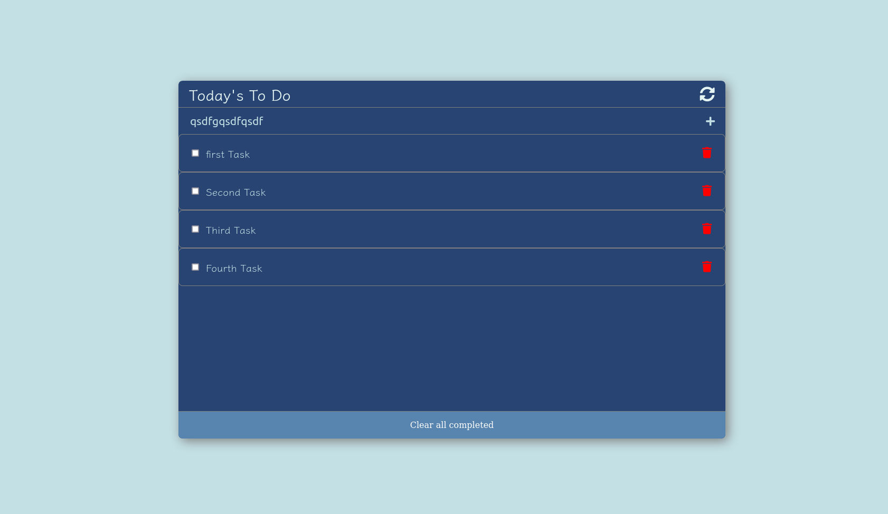

# To Do

> A simple minimalist browser based application to create save and manage your daily task.

Additional description about the project and its features.

## Built With

- Html/Css
- Javascript
- Webpack

## Live Demo
Deployed to Github Pages

[Live Demo Link](https://benwmx.github.io/toDo/)

## Getting Started

to use this repo please follow this steps : 

### Prerequisites
you need npm to run the webpack commands, if you don't already have it go to this link to install it in your machine [npm](https://docs.npmjs.com/downloading-and-installing-node-js-and-npm)
### Setup

- clone the repo : `https://github.com/benwmx/toDo.git`
- create your branch
- run `npm i`
### Usage
- add your changes
- run `npm start` to see the changes in your browser
- you can use this repo in your local machine to save your to do list, the data well be saved in the local storage of your browser, to do that you need configure the webpack-dev-server to use the same port every time you launch it, add this `port: 9000` (9000 or another port)to webpack.config.js file
 `devServer: { static: './dist',
    add-the-port-in-this-line
 }`

👤 **Rachid Boudaoudi**

- GitHub: [@benwmx](https://github.com/benwmx)
- Twitter: [@ben_wmx](https://twitter.com/ben_wmx)
- LinkedIn: [Rachid Boudaoudi](https://www.linkedin.com/in/rachid-boudaoudi-1621a0183/)
## 🤝 Contributing

Contributions, issues, and feature requests are welcome!

Feel free to check the [issues page](../../issues/).

## Show your support

Give a ⭐️ if you like this project!

## 📝 License

This project is [MIT](./MIT.md) licensed.
